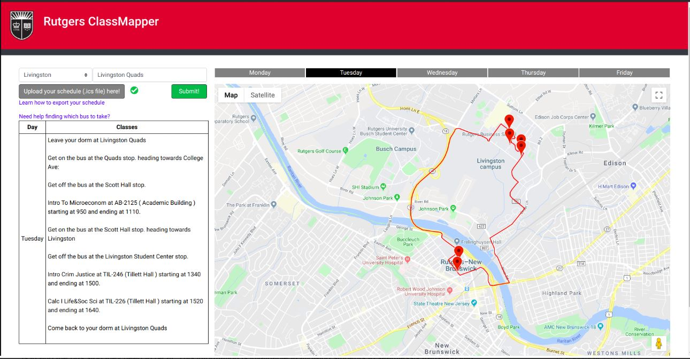
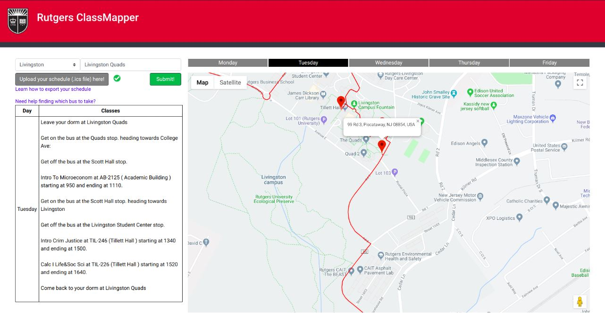
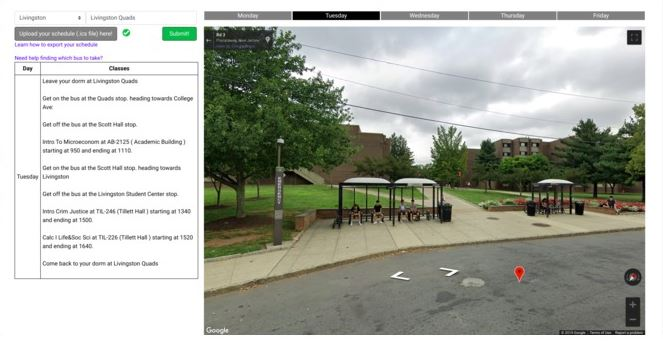

# classMapper

A webapp created at the 2019 Fall HackRU Hackathon. Helps Rutgers students unfamiliar with the sprawling Rutgers New Brunswick Campus find their way to classes. Uses the Google Maps API and the Rutgers Bus API to figure out which bus stops a user needs to use, and allows the user to map out their entire week's schedule. Also allows for users to go into Google Maps StreetView and see what their class buildings look like virtually.

https://devpost.com/software/classmapper
